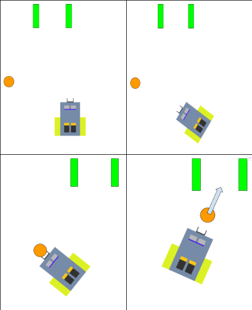

# FootBot
An Arduino-based footballing robot of prodigious skill

FootBot is a robot driven by two independently controled motors, that aims to navigate a room to shoot a ball of random position into a goal of random position. This is accomplished by synthesizing visual imput from a Pixy camera and encoder readings to gather information on its surroundings and location.

## Motor Controller

A Proportional-Derivative motor controller makes use of data from the wheels' encoders in order to allow more precise control of the angular velocity of the wheel, and eliminate issues caused by: 
* Disparity between the motors' strength 
* Environment 
* Battery degredation, etc. 

An H-Bridge facilitates control of motor direction and PWM.

## Imaging

We use a Pixy2 Camera to detect a brightly colored ball's position. Initially, the robot spins until the ball enters its vision. Footbot uses proportional motor control based on the angle of the ball in order to navigate towards it. Similar protocols are used to locate the goal. <? Ultrasonic sensors ensure the robot is within 'shooting range' of the goal ?> A solenoid then 'kicks the ball.'

## Power

The robot is powered by a combination of reusable Lithium batteries, with a seperate source for the Arduino and the H-Bridge

## Authors

[Sunil Madhow](https://github.com/SunilMadhow)  
[Blake Lazarine](https://github.com/BlakeLazarine)

## Acknowledgements

Professor Joao Hespanha

Sharad Shankar

Henrique Ferraz

