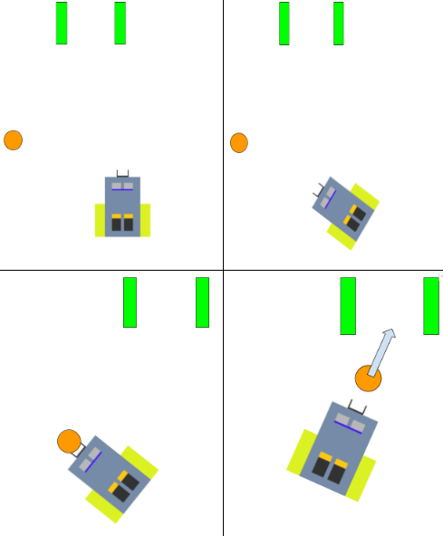

# FootBot
An Arduino-based footballing robot of prodigious skill

FootBot is a robot driven by two independently controled motors, that aims to navigate a room to shoot a ball of random position into a goal of random position. This is accomplished by synthesizing visual imput from a Pixy camera and encoder readings to gather information on its surroundings and location. This robot took two months to design, construct, and troubleshoot.

## Motor Controller

A Proportional-Derivative motor controller makes use of data from the wheels' encoders in order to allow more precise control of the angular velocity of the wheel, and eliminate issues caused by:
* Disparity between the motors' strength
* Environment
* Battery degredation, etc.

An H-Bridge facilitates control of motor direction and PWM (wired as shown below).

## Imaging

We use a Pixy2 Camera to detect a brightly colored ball's position. Initially, the robot spins until the ball enters its vision. Footbot uses proportional motor control based on the angle of the ball in order to navigate towards it. Similar protocols are used to locate the goal. <? Ultrasonic sensors ensure the robot is within 'shooting range' of the goal ?> A solenoid then 'kicks the ball.'

## Power

The robot is powered by a combination of reusable Lithium batteries, with a seperate source for the Arduino and the H-Bridge

## The Process

We encountered several problems throughout the duration of the project, such as:
* Very noisy encoder readings (fixed by changing timing on interrupts)
* Problems with the Pixy camera (careful callibration necessary for ideal readings)
* Motors of vastly different strengths (fixed with PID controller)
* Testing the robot was also difficult, as we did it in a room with uneven lighting and several obstacles.

Improvements that could be easily implemented include:
* Keeping track of goal position the moment it has been sighted (using encoder readings)
* Adding 'goal-line tech' to confirm goal has been made

We learned about many aspects of design, construction, and engineering over the course of this project, as well as becoming acquainted with several common and important components in robotics

## Authors

[Sunil Madhow](https://github.com/SunilMadhow)  
[Blake Lazarine](https://github.com/BlakeLazarine)

## Acknowledgements

Professor Joao Hespanha

Sharad Shankar

Henrique Ferraz

Raphael Chinchilla

